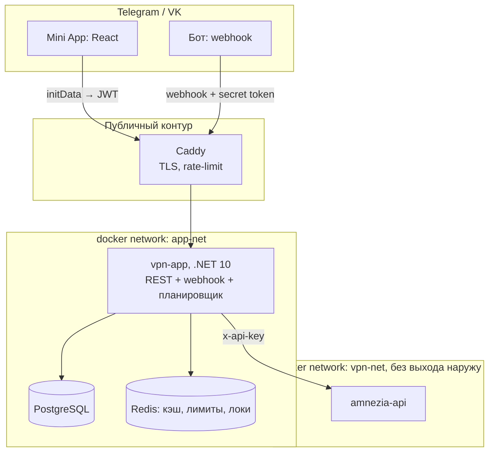

# Amnezia Access Bot

Telegram- и VK-бот с Mini App для выдачи и учёта доступа к собственному серверу AmneziaWG.
Убирает ручную работу администратора: ключ на устройство, срок действия, отзыв, перевыпуск,
диагностика — без SSH на сервер. Работает поверх [amnezia-api](https://github.com/kyoresuas/amnezia-api).

Исходный код закрыт. Здесь — устройство системы и решения, которые за ним стоят.
Код покажу на собеседовании, доступ на чтение дам по запросу.

.NET 10 · ASP.NET Core Minimal API · EF Core, PostgreSQL 17 · Redis 7 · React (Telegram Mini App) ·
Telegram Bot API, VK API · Docker Compose, Caddy · GitHub Actions

## Архитектура



Один контейнер — REST API, вебхук бота и планировщик. Вебхук Telegram — обычный HTTP POST,
отдельный процесс под него не нужен: общая база, общий кэш, один деплой. Шов для разделения
на два сервиса заложен — бот работает только через слой use-case'ов и не ходит в базу напрямую.

`amnezia-api` живёт в отдельной docker-сети и не публикует порты даже на localhost.
Из приложения в неё ходит только `vpn-app`.

```
Vpn.Domain          сущности и правила, без зависимостей
Vpn.Application     use-case'ы: выдача, продление, биллинг, поддержка, привязка аккаунтов
Vpn.Infrastructure  PostgreSQL, Redis, клиент amnezia-api, фоновые задачи
Vpn.Presentation    экраны, общие для Telegram и VK
Vpn.Bot / Vpn.Vk    транспорт мессенджеров
Vpn.Api             HTTP API для Mini App, проверка initData
Vpn.MiniApp         React-клиент
```

## Решения: архитектура из ограничений внешнего API

До кода контракт `amnezia-api` сверен с его `openapi.json`. Из пяти ограничений выросла
вся схема:

1. **Конфиг клиента отдаётся ровно один раз** — в ответе на создание. Поэтому он нигде
   не хранится: ни в базе, ни в Redis, ни в outbox, ни в логах. Сообщение с конфигом и QR
   удаляется через 5 минут, «показать ещё раз» — это перевыпуск с отзывом старого ключа.
2. **Создание не идемпотентно, а идентификатор генерирует сервер.** Таймаут на нашей стороне
   не значит «не создалось». Перед повтором — сверка по имени клиента, никаких слепых ретраев.
3. **Список клиентов листается по 100 записей.** Реконсиляция обязана пройти до конца,
   иначе на 101-м клиенте система молча начнёт «терять» ключи. На каждый запрос
   пользователя список не запрашивается — он в кэше.
   В первой редакции плана пагинацию пропустили; нашли при сверке со спецификацией.
4. **Имя клиента — единственное поле, которое пишем мы.** Оно же ключ связи между базой
   и сервером: `tg{telegramUserId}-{deviceShortId}`.
5. **QR — цепочка изображений.** Свой генератор не годится: клиент Amnezia такой не импортирует.

Эндпоинты бэкапа и перезагрузки сервера не существуют ни в клиенте API, ни в прокси:
бэкап содержит приватные ключи всех клиентов и остаётся операцией через SSH.

## Безопасность

Требования сведены в чек-лист перед production. Основное:

- `initData` проверяется только на сервере: HMAC-SHA256, сравнение за постоянное время,
  `auth_date` не старше 5 минут.
- Короткий access JWT хранится только в памяти Mini App, refresh — в `HttpOnly` cookie.
- Каждый `deviceId` и `ticketId` сверяется с текущим пользователем. Чужой и несуществующий
  ресурс отвечают одинаковым `404`.
- Вебхук: случайный путь, обязательный secret token, запросы только из подсетей Telegram.
- `callback_data` в кнопках — одноразовый токен в Redis, а не `action:id`.
- Секреты, `initData`, конфиги и заголовки авторизации вырезаются из логов до записи.

## Устойчивость

- Сервис поднимается, даже если зависимости ещё не готовы.
- История миграций восстанавливается после сбоя при первом запуске.
- Вебхуки Telegram и VK регистрируются при старте.

Каждый из этих сценариев покрыт интеграционными тестами.

## Как велась разработка

90 коммитов, 23 фича-ветки. До кода в плане зафиксированы контракт внешнего API, доменная
модель, требования безопасности и разбивка на треки. У каждого трека закреплённая зона
каталогов, общие файлы — домен и порты — меняются только через координатора: так
параллельные ветки не ломают друг другу мерж. Треки выполняли ИИ-агенты в отдельных
git worktree; план, контракты между треками и приёмка — на мне.

## Проверка

- 220 тестов xUnit: юнит, интеграционные и сквозной E2E-сценарий. Тесты Mini App.
- GitHub Actions: сборка и тесты на каждый push и pull request, отдельный workflow деплоя.
- Документация: план с контрактами, HTTP API, чек-лист безопасности, runbook эксплуатации.
